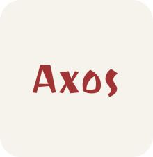

# axos

[![CI Build Status]][actions]
[![Release]][actions]
[![Tag Build Status]][actions]
[![License]][mit-license]
[![Docs]][Docs-rs]
[![Latest Version]][crates.io]
[![rustc 1.31+]][Rust 1.31]

[CI Build Status]: https://img.shields.io/github/actions/workflow/status/refcell/axos/ci.yml?branch=main&label=build
[Tag Build Status]: https://img.shields.io/github/actions/workflow/status/refcell/axos/tag.yml?branch=main&label=tag
[Release]: https://img.shields.io/github/actions/workflow/status/refcell/axos/release.yml?branch=main&label=release
[actions]: https://github.com/refcell/axos/actions?query=branch%3Amain
[Latest Version]: https://img.shields.io/crates/v/axos.svg
[crates.io]: https://crates.io/crates/axos
[rustc 1.31+]: https://img.shields.io/badge/rustc_1.31+-lightgray.svg
[Rust 1.31]: https://blog.rust-lang.org/2018/12/06/Rust-1.31-and-rust-2018.html
[License]: https://img.shields.io/badge/license-MIT-7795AF.svg
[mit-license]: https://github.com/refcell/axos/blob/main/LICENSE.md
[Docs-rs]: https://docs.rs/axos/
[Docs]: https://img.shields.io/docsrs/axos.svg?color=319e8c&label=docs.rs

**Portable no-std Derivation Pipeline engineered in pure Rust** https://github.com/refcell/axos/labels/alpha

<p align="center">
  
</p>

<!--  -->

**[Install](#usage)**
| [User Docs](#what-is-axos)
| [Crate Docs][crates.io]
| [Reference][Docs-rs]
| [Contributing](#contributing)
| [License](#license)

## What is axos?

Portable no-std Derivation Pipeline engineered in pure Rust.

## Usage

`axos` is meant to be used as a library with [cargo][crates.io].
Add it to your project with [`cargo add`](https://github.com/rust-lang/cargo/tree/master/src/cargo/ops/cargo_add).

```text
cargo add axos
```

## Contributing

All contributions are welcome! Experimentation is highly encouraged and new issues are welcome.

## Troubleshooting & Bug Reports

Please check existing issues for similar bugs or
[open an issue](https://github.com/refcell/axos/issues/new)
if no relevant issue already exists.

## License

This project is licensed under the [MIT License](LICENSE.md).
Free and open-source, forever.
*All our rust are belong to you.*

