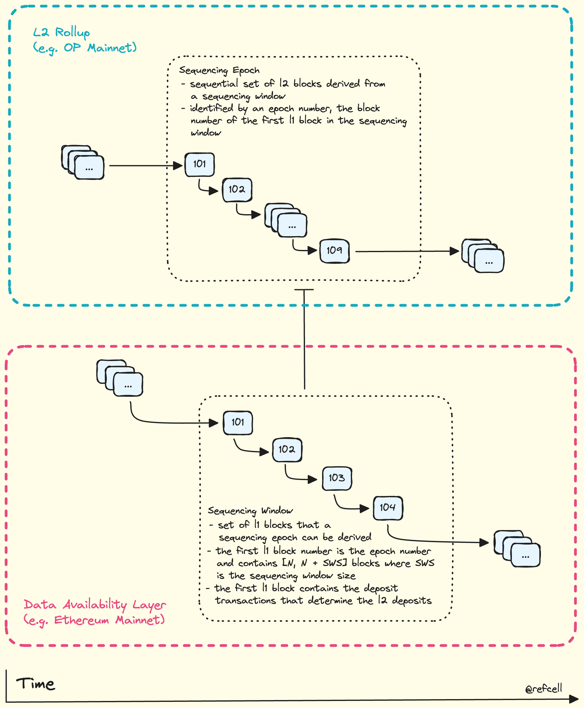

# Derivation

*Before diving into chain derivation below, make sure you have
a strong fundamental understanding of [batch submission][b].*

The derivation pipeline acts as the counterpart to [batch submission][b].

Where L2 transactions are *posted* to the data availability layer,
or L1 Ethereum Mainnet for L2 OP Mainnet, derivation is the process of
translating the batch-submitted output data on L1 (the DA layer)
into a canonical ordering of L2 transactions.

### Genesis

Rollups start at genesis. For the sake of keeping scope limited
to the OP Stack, genesis refers to the bedrock activation block,
which for all new OP Stack chains is equivalent to block 0 since
bedrock is active at genesis.

_Aside: visit [optimism.io][opio] for a detailed walkthrough of
the differences between OP Mainnet pre and post-bedrock._

### Derivation

The derivation pipeline is one of the key components of a [rollup][rollup].

At a high level, the derivation pipeline reads blocks from the data
availability layer (for example Ethereum Mainnet, or "L1"), and outputs
canonical rollup blocks (aka "L2" blocks).

Since the size of transaction batches may not compress enough to fit
in a single block, batches are split up such that a [sequencing window][sw]
is defined spanning multiple L1 blocks.

The first L1 block in the sequencing window marks the [sequencing epoch][se]
and its block number is used as the [epoch number][en].

Concisely, the set of L1 sequencing window blocks maps to a set of L2 blocks
which are derived from batch transactions within those L1 blocks.

Ignoring channels and frames for a moment, derivation is quite simple at
a high level. A basic illustration is presented below.

<!--

-->

In the presented sequencing window, the first L1 block is number `101`.
This is used as the epoch number for the set of L2 blocks ("sequencing epoch")
derived from the set of L1 blocks, "sequencing window".

### Frames, Channels, and Batches 

<!-- Intradoc refs -->

[b]: ./batching.md
[se]: ./glossary.md#sequencing-epoch
[sw]: ./glossary.md#sequencing-window
[en]: ./glossary.md#epoch-number

<!-- Hyperlinks -->

[rollup]: https://community.optimism.io/docs/protocol/2-rollup-protocol
[opio]: https://community.optimism.io/docs/developers/bedrock/explainer/#
